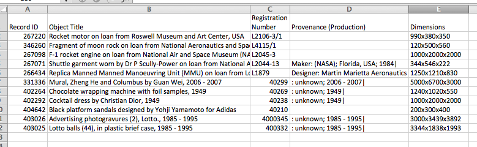
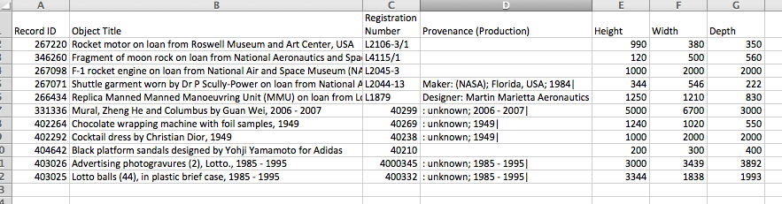

## Learning Objectives
* Learning best practices for recording and formatting data in spreadsheets
* Understanding the correspondence between columns and rows in spreadsheets
and data structure
* Understanding the correspondence between spreadsheet cells, columns and rows
and data observations and values

The purpose of this lesson is to demonstrate how to use a spreadsheet to import or record your data, organize your data, clean your data, and then export you data for use in another software program (such as R). In order to do all this, it is important to understand that computers are very literal. We have to tell the computer **exactly** how to interpret and read our data, or it won't be able to use that data to produce reliable results.

This is why it’s extremely important to set up well-formatted tables from the
outset- before you even start entering data from your very first preliminary
experiment. **Data organization is the foundation of your research project.**
It can make it easier or harder to work with your data throughout your
analysis, so it's worth thinking about when you're doing your data
entry or setting up your experiment. You can set things up in a different
way in spreadsheets, but it limits your ability to work with the data
in other programs or have the you-of-6-months-from-now or your collaborator
work with the data.

###Structuring data in spreadsheets

There are two rules you should keep in mind when entering your data
into any spreadsheet:

1. Each data cell is an observation that must have all the relevant information
connected to it for it to stand on its own.

2. You must make it clear to the computer how the data cells relate to the
relevant information and each other.

For instance we have data from the Sydney museum on all the objects in
its collection. They keep track of things like the object's name,
registration ID, provenance, and size.

[http://www.powerhousemuseum.com/collection/database/download.php](http://www.powerhousemuseum.com/collection/database/download.php)

If they were to store the data about the object's size like this

they'd have a problem. In this case, three dimensions (height, width, and length) are all in the same column). If we wanted to search for an object with a certain height, we would be unable to. Instead, each measurement or dimentsion should be in its own column.

###Columns for variables and rows for observations

The rule of thumb, when setting up a datasheet, is columns = variables,
rows = observations, and cells = data or values.

Therefore, instead of the messy example above, we should have the clean example below:

### Exercise

We're going to take a messy version of the Syndney museum collection data
and clean it up.

- Download the data by clicking on the link -- [phm-collection-messy.xls](phm-collection-messy.xls).

- Open up the data in a spreadsheet program. (I'm going to use Excel.)

- You'll notice that there are two tabs of data -- Acquired 1990s and Acquired 2000s. Each tab of data was logged by a different curator, and each curator logged their data using their own format.

- As the new curator, the museum director wants YOU to provide her with stats on the number of each type of object in the collection AND when that object was acquired.

- With the person next to you, work on the messy data to clean it up so
that a computer will be able to understand it.

After you go through this exercise, we'll discuss as a group what you think was wrong with this data organization and how you fixed it.  

Previous: [Introduction](00-intro.html)  Next: [Common formatting mistakes](02-common-mistakes.html)