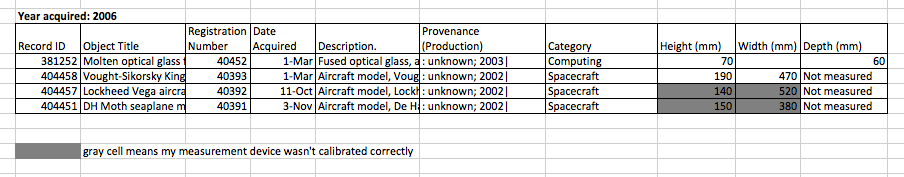
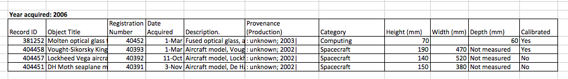

## Common Spreadsheet Errors

- [Multiple tables](#tables)
- [Multiple tabs](#tabs)
- [Not filling in zeros](#zeros)
- [Using bad null values](#null)
- [Using formatting to convey information](#formatting)
- [Using formatting to make the data sheet look pretty](#formatting_pretty)
- [Placing comments or units in cells](#units)
- [More than one piece of information in a cell](#info)
- [Field name problems](#field_name)
- [Special characters in data](#special)

## Multiple tables

A common strategy when collecting or recording your data is to create multiple data tables within
one spreadsheet or one tab. While this may work fine if ONLY a human were to read the table, it will cause problems for a computer that is trying to read your data.

For example:

Remember, if we consider each row to be ONE observation, the computer will assume that ALL data contained on row 5 is from ONE observation. But in this case, the data on row 5, contained within four different tables, is from MULTIPLE observations.

## Multiple tabs

What about using multiple tabs to enter or record data? Say, one tab for each set of daily observations?

This may cause problems for two reasons:

1. You are more likely to accidentally add inconsistencies to your data if each time you take a measurement, you start recording data in a new tab. This is mainly because you are unable to see HOW you've been entering data up until that point (because it's on a different tab).

2. Even if you manage to prevent all inconsistencies from creeping in, having data on multiple tabs will add extra work for you later as you'll need to consolidate that data before you can analyze it.

The next time you’re entering data, and you go to create another tab or table, I want you to ask yourself “Self, could I avoid adding this tab by adding one or more columns to my original tab?”

Your datasheet might end up really long over the course of experiment. But if you freeze the rows that contain your headings, you'll always be able to headings when entering your data.

TIP: Don't repeat or reuse header titles or names. Each header should be unique.

ANOTHER TIP: Do not add spaces to your header titles or names. Instead use capital letters or an underscore to differentiate words in the title.

- Demonstration of freezing column headers.

## Not filling in zeroes

Spreadsheets interpret a ZERO value and a BLANK cell completely differently. Before using a ZERO value in a cell for an observation, think about the purpose of that ZERO. 

If the ZERO value represents an actual result that must be counted as a result, then include the ZERO.

If the ZERO value represents a non-existent result or an absent result, then do NOT include the ZERO. Just leave the cell blank.

For example, if you're counting the number of times you saw a chickadee at a bird feeder within a specified period of time, and you put ZERO, the computer will interpret that as a result. However, in this case, not seeing a chickadee is really not a result, it simply means you didn't see any chickadees -- just like you didn't see any whales or canoes or Hollywood celebrities.

When a cell is left blank, the computer will interpret that as a NULL value. If you later asked the computer to count the number of days on which you saw at least one chickadee at the feeder, it will NOT count blank cells, only cells which contain values.

## Using bad null values
**Example**: Using -999 or other numerical values (or zero).

**Solution**: Many statistical programs will not recognize that numeric values of NULL are indeed NULL. It will depend on the final application of your data and how you intend to analyse it, but it is essential to use a clearly defined and CONSISTENT NULL indicator. Blanks (most applications) and NA (for R) are good choices.

From White et al, 2013, [Nine simple ways to make it easier to (re)use your data.](http://library.queensu.ca/ojs/index.php/IEE/article/view/4608/4898) 

Ideas in Ecology and Evolution:

## Using formatting to convey information
**Example**: Highlighting cells, rows, or columns that should be **excluded** from an analysis OR leaving blank rows to indicate separations in data.

**Solution**: Create a new field to encode which data should be excluded.

## Using formatting to make the datasheet look pretty

**Example**: Merging cells.

**Solution**: If you’re not careful, formatting a worksheet to be more aesthetically pleasing can compromise your computer’s ability to see associations in the data. Merged cells are an absolute formatting NO-NO if you want to make your data readable by statistics software. Consider restructuring your data in such a way that you will not need to merge cells to organize your data.

## Placing comments or units in cells

**Example**: Your data was collected, in part, by a summer student you later found out was mis-identifying some of your species, some of the time. You want a way to note these data are suspect.

**Solution**: Excel "comments" -- again, while useful to humans -- are not useful to computers. Most statistical software will have no idea what to do with these comments which means they could end up giving you incorrect results. If you must include comments, add a new column just for recording those comments. You can later exclude that column from statistical analysis if needed.

Measurement units should be the same for all values in one column. For example, if you're recording height, ALL entries should be metres or feet, but not a combination of both. If it is absolutely necessary to enter multiple units for one field, enter them in separate columns and convert them later into one column.

## More than one piece of information in a cell

**Example**: You find one male and one female of the same species. You enter this as 1M, 1F.

**Solution**: Like many of our other examples, this can easily be interpreted by a human, but not by a computer (at least, not without a lot of work). In this case, there should be separate columns for recording the number of males and females of the species you observed.

## Field name problems
Choose descriptive field names, but be careful not to include: spaces, numbers, or special characters. Spaces can be misinterpreted by parsers that use whitespace as delimiters and some programs don’t like field names that are text strings that start with numbers.
Underscores (`_`) are a good alternative to spaces, and you can write names in camel-case to improve readability (e.g., CamelCase). 

Keep a good balance between abbrevaitions that may not make sense in several months and extremely long and descriptive titles.

### Examples

**good name** | **good alternative** | **avoid**
------------- | -------------------- | ---------
Max_temp     | MaxTemp              | Maximum Temp (°C)
Precipitation | Precipitation_mm | precmm
Mean_year_growth | MeanYearGrowth | Mean growth/year
sex | sex | M/F
weight | weight | w.
cell_type | CellType | Cell type
first_observation | Observation_01 | 1st Obs.

## Special characters in data

**Example**: You treat Excel as a word processor when writing notes, even copying data directly from Word or other applications.

**Solution**: While this may be a common process when using spreadsheets to record notes, it can cause problems down the road. While it is possible, for example, to include newlines in a cell, that newline character may be misunderstood by statistical software at a later stage. Items like newlines, indentations, em-dashes, quotation marks, etc., should not be used in a spreadsheet when recording notes. If these items are absolutely needed, consider using the cell to reference notes written in a Word document instead. 

Previous: [Formatting data tables in spreadsheets.](01-format-data.md) Next: [Dates as data.](03-dates-as-data.md)