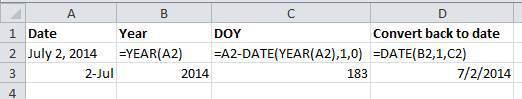

# Dates as Data #

## Learning Objectives ##

* Understanding how dates are handled and formatted in spreadsheets.
* Manipulating dates stored in spreadhseets.
* Understanding the caveats of the default formatting.

Dates in spreadsheets are stored in one column. Whilst this seems the most natural way to record dates, it's actually not a good practice. A spreadsheet application will display the dates in seemingly correct way (for the human eye) but how it actually handles and stores the dates may be problematic.

Let's try with a simple challenge.

#### Challenge: pulling month and year out of dates ####

+   In the <i>phm-collection-messy.xls</i> file, 'Date acquired' is a column.
+   In the 'Acquired 2000s tab,' let's extract **month** and **year** from the dates and add them to new columns. For this we can use the built in Excel functions:

=MONTH(cell)  
=YEAR(cell)

(Make sure the new column is formatted as a number and not as a date.)

You can see that even though you wanted the year to be 2006, Excel automatically interpreted it as 2015, the year you entered the data.

**Note**: Excel is unable to parse dates from before 1899-12-31, and will thus leave these untouched. If you’re mixing historic data from before and after this date, Excel will translate only the post-1900 dates into its internal format, thus resulting in mixed data. If you’re working with historic data, be extremely careful with your dates!

Excel also entertains a second date system, the 1904 date system, as the default in Excel for Macintosh. This system will assign a different serial number than the [1900 date system](https://support.microsoft.com/kb/180162). Because of this, [dates must be checked for accuracy when exporting data from Excel](http://datapub.cdlib.org/2014/04/10/abandon-all-hope-ye-who-enter-dates-in-excel/) (look for dates that are ~4 years off).

## Data formats in spreadsheets ##

Spreadsheet programs have numerous “useful features” which allow them to “handle” dates in a variety of ways.

But these "features" often allow ambiguity to creep into your data. Ideally, data should be as unambiguous as possible.

### Dates stored as integers ###

The first thing you need to know is that Excel **stores dates as numbers** (e.g., see the last column in the above figure). Essentially, it counts the days from a default of December 31, 1899, and thus stores July 2, 2014 as the serial number 41822.

This serial number thing can actually be useful in some circumstances. Say you had a sampling plan where you needed to sample every thirty seven days. In another cell, you could type:

    =B2+37

And it would return

    8-Aug

because it understands the date as a number `41822`, and `41822 +37 = 41859` which Excel interprets as August 8, 2014. It retains the format (for the most part) of the cell that is being operated upon (unless you did some sort of formatting to the cell before and then all bets are off).

Which brings us to the many wonderful customizations Excel provides in how it displays dates. If you refer to the figure above, you’ll see that there are many, MANY ways that ambiguity creeps into your data depending on the format you chose when you enter your data. And if you’re not fully cognizant of which format you’re using, you can end up actually entering your data in a way that Excel will misinterpret.

**Question**  
What will happen if you save the file in Excel (in `csv` format) and then open the file using a plain text editor?

**Note**  
You will notice that when exporting into a text-based format (such as CSV), Excel will export its internal date integer instead of a useful value (that is, the dates will be represented as integer numbers). This can potentially lead to problems, if you use other software to manipulate the file.

### Advantages of Day-of-Year Formatting ###

#### Challenge: understanding the DOY formatting ####

Download and open from the [a spreadsheet with a list of dates](date-doy-exercise.xls).  

+ The dates in the first column seem to be OK. You could, for example, record dates in this manner if each tab or whole spreadsheet contained dates just from one particular year.
+ However, when you look at the second column, you can see that these dates were interpreted in a quite differently!

Storing dates in `Day-of-Year` format helps remove this ambiguity. Let's look at this issue a bit closer.

Example from 2015:

If Excel was to be believed, the person recording this data collected items IN THE FUTURE!

Entering dates in the `DOY` format in one cell is helpful, but due to the fact that the spreadsheet programs may interpret and save the data in different ways (doing that somewhat behind the scenes), there is a better practice. 
 
In dealing with dates in spreadsheets, we recommend using one of the two following options:

1. Separating **date data into separate fields** (day, month, year).
2. Storing dates in two fields -- YEAR and day of the year (DOY). 

You can easily convert your dates into the DOY format using a handy formula in Excel:

Previous: [Common formatting mistakes by spreadsheet users.](02-common-mistakes.md) Next: [Basic quality control and data manipulation in spreadsheets.](04-quality-control.md)