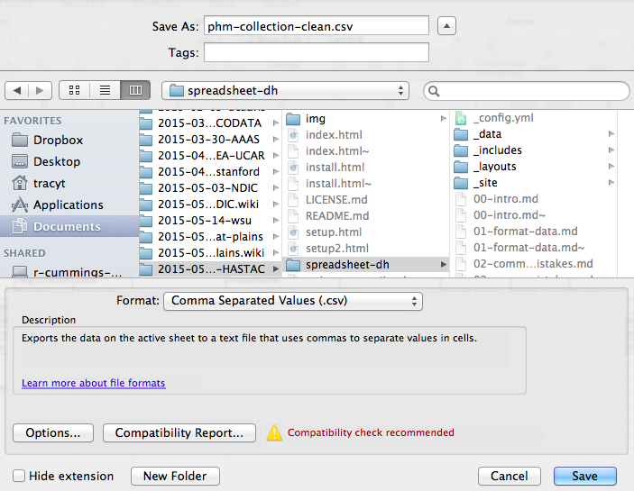

## Exporting Data

###Spreadsheet data formats

Excel files default to the `*.xls` or `*.xlsx` file formats (depending on the Excel version you're using.) While this works great if you're opening and re-opening the files in Excel, it might cause problems if you're trying to open the files in another software program. When Excel saves a file to these formats, it includes special formatting that may not be able to be interpreted by another program. Therefore, when saving your data, especially if you're going to use it in another program, it's best to EXPORT the data into another file format.

*This is even helpful if you're using multiple versions of Excel. The formatting Excel has used over time has changed. And some old Excel files, opened in a new version of Excel, (or vice versa), aren't interpreted properly and the data can be compromised.*

One great format to use is the universal, open, and static format of tab- or common-delimited. These files are plain text files that separate the data from each column using a specific delimiter (in this case, a tab character or a comma). A `*.csv` file can be imported or opened in a large variety of software programs, including Excel, R, SPSS, and even just a text editor. 

To save a file you have opened in Excel into the `*.csv` format:

1. From the top menu select 'File' and 'Save as'.
2. In the 'Format' field, from the list, select 'Comma Separated Values' (`*.csv`).
3. Double check the filename and location where you want to save it and hit 'Save'.

## A Note on Cross-platform operability##

By default, most coding and statistical environments expect UNIX-style line endings (`\n`) as representing line breaks. However, Windows uses an alternate line ending signifier (`\r\n`) by default for legacy compatibility with Teletype-based systems. As such, when exporting to CSV using Excel, your data will look like this:

>data1,data2\r\n1,2\r\n4,5\r\n…

which, upon passing into most environments (which split on `\n`), will parse as:

>data1 
>data2\r 
>1 
>2\r 
>...

thus causing terrible things to happen to your data.

For example, `2\r` is not a valid integer, and thus will throw an error (if you’re lucky) when you attempt to operate on it in R or Python. Note that this happens on Excel for OSX as well as Windows, due to legacy Windows compatibility.

There are a handful of solutions for enforcing uniform UNIX-style line endings on your exported CSVs:

1. When exporting from Excel, save as a “Windows comma separated (.csv)” file.
2. If you store your data file under version control (which you should be doing!) using Git, edit the `.git/config` file in your repository to automatically translate `\r\n` line endings into `\n`.

Add the follwing to the file ([see the detailed tutorial](http://nicercode.github.io/blog/2013-04-30-excel-and-line-endings)):

		[filter "cr"]
    		clean = LC_CTYPE=C awk '{printf(\"%s\\n\", $0)}' | LC_CTYPE=C tr '\\r' '\\n'
    		smudge = tr '\\n' '\\r'`

and then create a file `.gitattributes` that contains the line:

 		*.csv filter=cr

3. Use [dos2unix](http://dos2unix.sourceforge.net/) (available on OSX, *nix, and Cygwin) on local files to standardize line endings.

Previous: [Basic quality control and data manipulation in spreadsheets.](04-quality-control.html) Next: [Caveats of popular data and file formats.](06-data-formats-caveats.html)